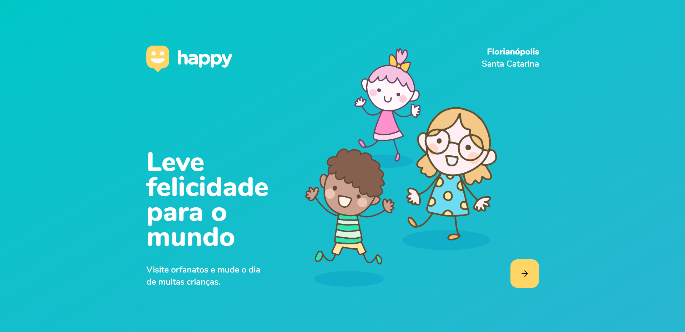
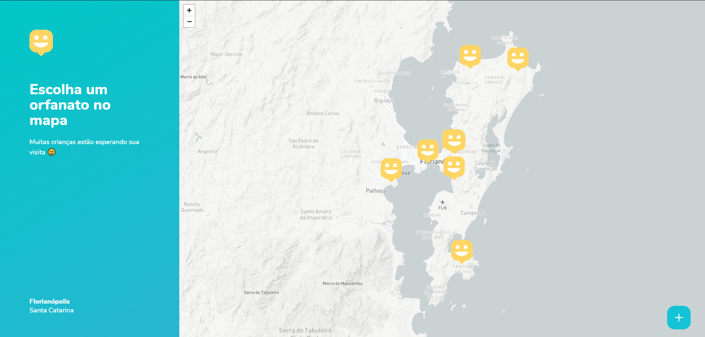
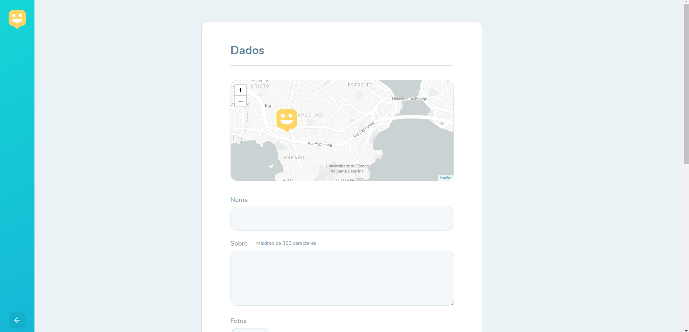
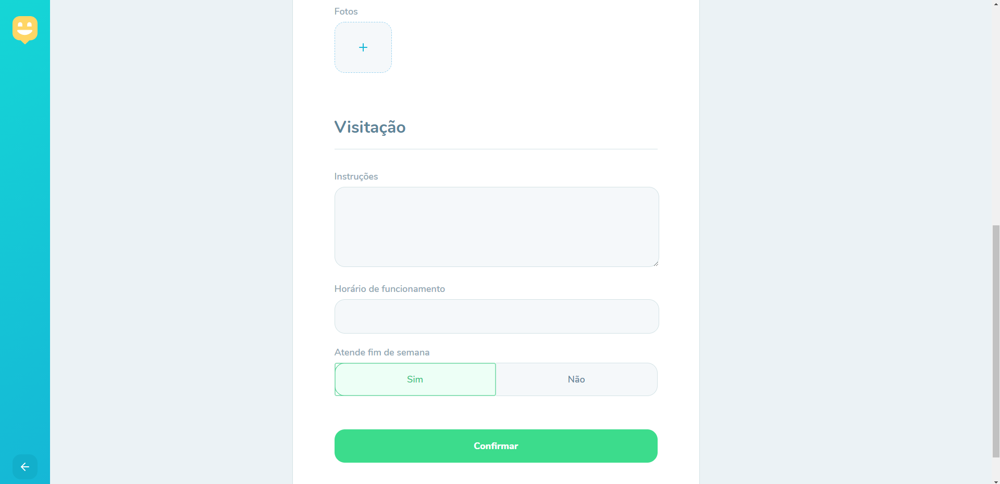
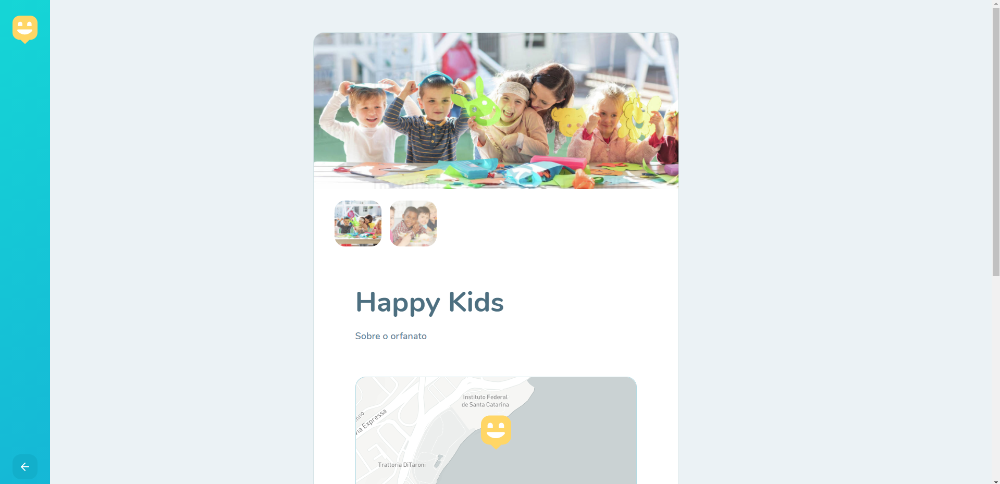
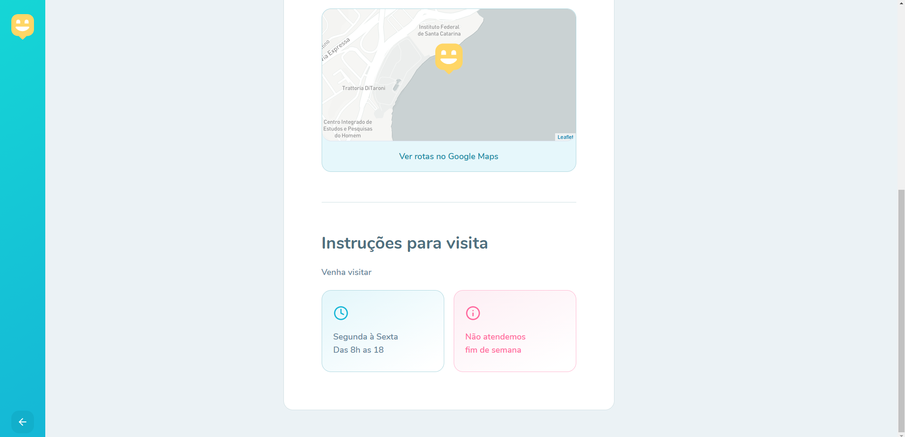

  <h1>Conheça o Happy</h1>

<strong>Happy</strong> é uma aplicação para visitas a casas de acolhimentos institucionais,  nele voce busca ou registra alguma dessas casas 

<h2>Landing page</h2>

<h2>Página de busca</h2>

<h2>Página de cadastro</h2>

<h2>Pagina da Casa de acolhimento</h2>

